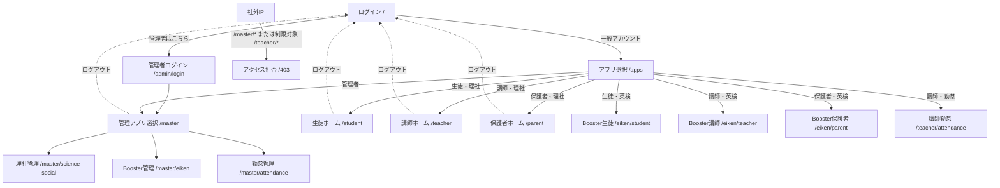
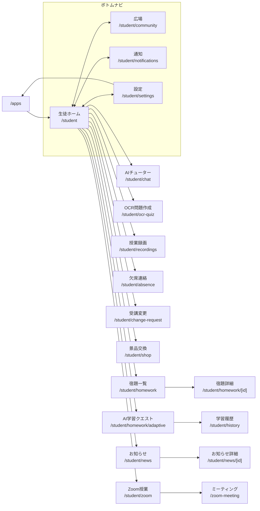
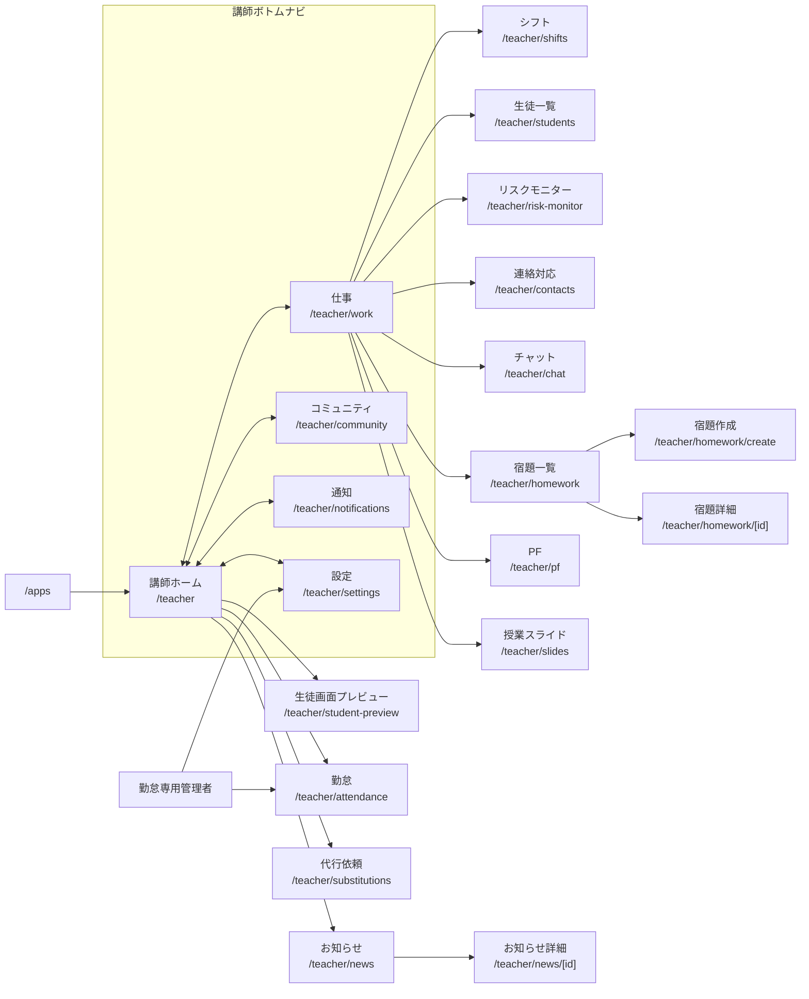
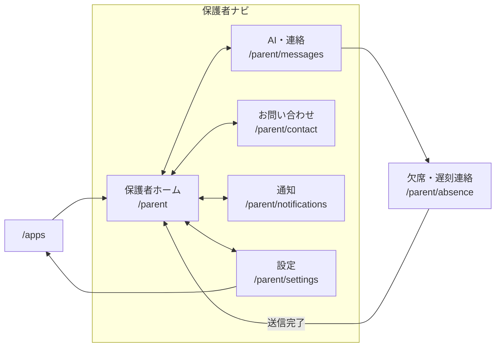
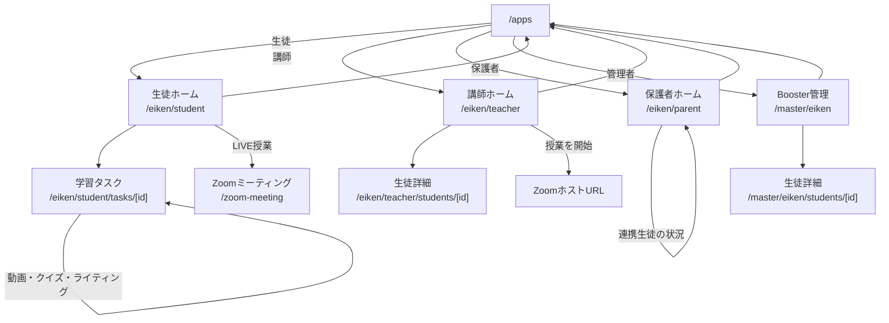
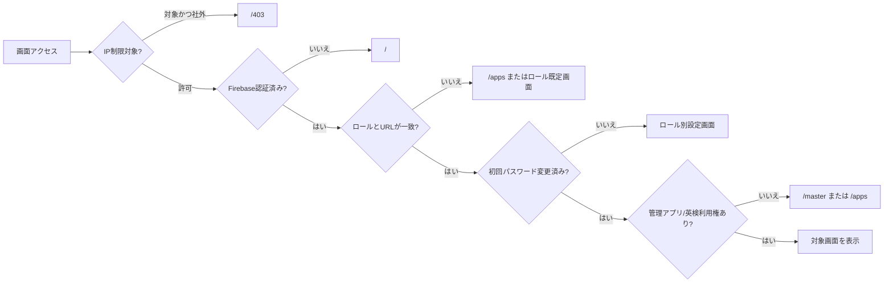

# 画面遷移図

最終更新: 2026-08-13

## 全体フロー

### 認証時の分岐

- 通常ログイン成功後は原則 `/apps` へ遷移する。
- 勤怠専用管理者は `/teacher/attendance` へ直接遷移する。
- `/apps` で利用可能アプリが1つだけの場合は、そのアプリのホームへ自動遷移する。
- 初回パスワード変更が必要な場合は、各ロールの設定画面へ先に遷移する。

## 生徒

## 講師・勤怠専用管理者

## 保護者

## 英検 Booster

## 管理者

```mermaid
flowchart TD
    Login["管理者ログイン<br/>/admin/login"] --> Hub["管理アプリ選択<br/>/master"]

    Hub --> SS["理社ダッシュボード<br/>/master/science-social"]
    Hub --> Eiken["Booster管理<br/>/master/eiken"]
    Hub --> Attendance["勤怠管理<br/>/master/attendance"]
    Hub --> Accounts["全体アカウント管理<br/>/master/accounts"]

    subgraph ScienceSocial["理社講座 管理権限"]
      SS --> Students["校舎別生徒<br/>/master/school-students"]
      SS --> Shifts["シフト<br/>/master/shifts"]
      SS --> Monthly["月間予定<br/>/master/monthly-schedules"]
      SS --> Subs["代行依頼<br/>/master/substitutions"]
      SS --> Announce["お知らせ配信<br/>/master/announcements"]
      SS --> Requests["承認・申請<br/>/master/requests"]
      SS --> ParentQ["保護者問合せ<br/>/master/parent-inquiries"]
      SS --> Registration["登録依頼<br/>/master/registration-tasks"]
      SS --> Allocation["講座割当<br/>/master/course-allocation"]
      SS --> Curriculum["カリキュラム<br/>/master/curriculum"]
      SS --> PF["PF<br/>/master/pf"]
      SS --> Recordings["授業アーカイブ<br/>/master/recordings"]
      SS --> Slides["授業スライド<br/>/master/slides"]
      SS --> Community["コミュニティ<br/>/master/community"]
      SS --> Rewards["景品・コイン<br/>/master/rewards"]
      SS --> Survey["アンケート<br/>/master/survey-settings"]
      SS --> Imports["CSV一括登録<br/>/master/imports"]
      SS --> Line["LINE管理<br/>/master/line"]
    end

    subgraph AttendanceAdmin["勤怠 管理権限"]
      Attendance --> Corrections["打刻修正承認<br/>/master/attendance-corrections"]
      Attendance --> Diagnostics["勤怠ミス候補<br/>/master/attendance/diagnostics"]
      Diagnostics --> Attendance
    end

    subgraph EikenAdmin["英検 管理権限"]
      Eiken --> EStudent["生徒詳細<br/>/master/eiken/students/[id]"]
    end

    subgraph MasterOnly["マスターのみ"]
      Accounts --> Recovery["再設定受付<br/>/master/accounts/recovery"]
      Accounts --> SSO["校舎別アカウント<br/>/master/accounts/sso"]
      Hub --> Access["アプリ権限<br/>/master/access-control"]
      Hub --> Users["ユーザー管理<br/>/master/users"]
      Hub --> Delete["アカウント削除<br/>/master/delete"]
      Hub --> SysSettings["システム設定<br/>/master/settings"]
      Hub --> Stats["統計・分析<br/>/master/stats"]
    end

    Imports --> Curriculum
    Imports --> Slides
    Slides --> TeacherSlides["講師向けスライド<br/>/teacher/slides"]
```

## 遷移制御の優先順位

## 注記

- 図は主要なナビゲーションと業務遷移を示す。ブラウザの戻る、外部URL、モーダル内遷移、同一画面内アンカーは省略した。
- メニュー項目はポータル公開設定によって非表示になる場合がある。
- Mermaid非対応のビューアでは、GitHubまたはMermaid対応Markdownビューアで参照する。
